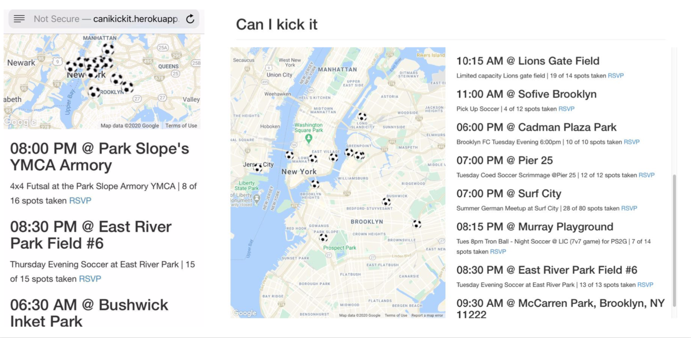

can i kick it -- a pickup soccer aggregator
====================================

### DESCRIPTION

This code collects pickup soccer matches from meetup and shows the pickup soccer games in New York for the next 24 hours. Using Redis, Sidetiq, Sidekiq and V2 of the meetup api, data was collected daily and stored in a postgresql database. 

### UPDATE
This site will no longer be supported given the updates to meetup api and the fact that this site is no longer used to find soccer matches by the creator. Though a [snapshot of the past](https://canikickit.herokuapp.com/) will be hosted for old times sake.